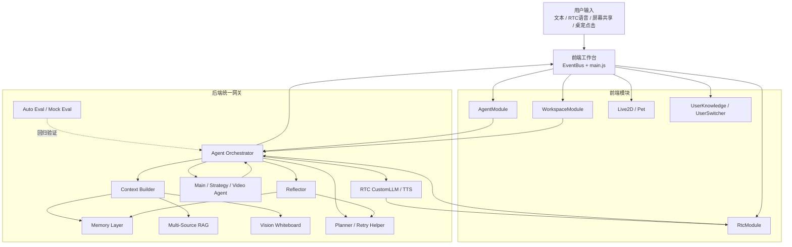

# 游戏 AI 助手

一个面向游戏场景的多模态 AI 助手工程 Demo，也是一套用于展示 Agent 架构能力的 showcase。它不是简单的聊天机器人，而是让 AI 像实时游戏搭子/教练一样，能听玩家说话、看游戏画面、查攻略资料、记住用户习惯，并在合适的时候给出低打扰建议。

这个项目覆盖了标准 Agent 的关键能力：**感知 -> 自主规划 -> 执行 -> 执行反馈 -> 反思 -> 记忆沉淀**。同时内置知识库、记忆库和自动化评测机制，用来支撑复杂游戏问答、个性化陪伴和长期可迭代的工程验证。

它可以帮玩家做这些事：

- 边玩边问英雄打法、出装、团战、资源取舍等问题
- 根据屏幕共享画面补充判断当前局势
- 从本地/云端知识库检索攻略并整理成易懂回复
- 自动搜索教学视频或相关平台结果
- 记住用户偏好和历史上下文，让后续对话更连续
- 在高压游戏场景中保持短句、轻提示或静默，减少打扰

## 工程亮点

- **闭环 Agent 架构**：主链路实时响应，Reflector 在后台异步反思与规划，不阻塞当前回复。
- **多模态统一入口**：文本、语音、屏幕观察、桌宠点击都接入同一套编排体系。
- **多源 RAG 检索**：本地知识、云端知识库、内置知识统一召回，经过 rerank 与来源加权后注入上下文。
- **分层记忆系统**：支持 `working / episodic / semantic / procedural` 四层记忆，并结合时间衰减进行召回。
- **静默屏幕感知**：前端定期抽帧，后端识别画面并写入会话白板，只增强上下文，不直接打扰用户。
- **RTC CustomLLM 桥接**：RTC 只承担实时语音通道，LLM 回复由后端 Agent 编排生成，再通过 TTS 推回语音链路。
- **复合任务规划**：TaskPlanner 支持 strategy / video / compound / silence 等任务形态，主回复先返回，次任务后台补偿。
- **工程化验证能力**：内置 `auto_eval_lite` 和多组 mock 脚本，可做回归评测、链路验证和能力演示。

## 闭环架构图



## 闭环链路

1. **感知**：接收文本、语音 ASR、屏幕画面和用户操作。
2. **记忆**：加载长期画像、overlay 记忆、分层记忆与 RTC 实时画像。
3. **规划**：本地意图路由、TaskPlanner 拆解、失败补偿、次任务编排。
4. **执行**：Main / Strategy / Video Agent 输出回复、卡片、链接和播报内容。
5. **反思**：Reflector 异步评分、归因、生成主动提示并升级高价值记忆。
6. **评测**：Auto Eval 按 `main_fast / strategy / video / compound / silence` 等轨道做回归验证。

## 核心模块

- `src/modules/agent/`：前端编排入口，负责请求去重、SSE 消费和任务状态同步。
- `src/modules/rtc/`：RTC 通话、字幕处理、屏幕共享、抽帧上报与远端音频控制。
- `src/modules/user-knowledge/`：本地用户知识入库、分域组织、与云端检索协同。
- `agentOrchestratorService`：整轮编排核心，串起上下文构建、主分支执行和反思回流。
- `taskPlannerService` + `retryHelperService`：复杂任务拆解、失败补偿、轻互动与可恢复任务的基础能力。
- `multiSourceKnowledgeService`：多源召回、统一 rerank、来源加权、缓存与成本控制。
- `memoryLayerService` + `memoryWriterService`：分层记忆编码、长期记忆抽取与写入。
- `screenEventService` + `visionFrameService`：屏幕识别、事件冷却、白板摘要与静默感知注入。
- `rtcLlmStreamService` + `rtcPushTtsService`：CustomLLM 流式回复与 RTC 语音播报桥接。
- `reflectorAgentService`：异步反思器，负责质量评分、主动提示与下一轮规划建议。

## 技术栈

| 层级 | 技术选型 |
| --- | --- |
| 前端 | Vanilla JS、Live2D、PixiJS |
| 后端 | Node.js、原生 HTTP |
| 实时交互 | 火山 RTC Web SDK |
| 大模型 | Seed 2.0、Seed 1.8 |
| 语音 | TTS V3 |
| 检索 | 本地知识库 + 火山知识库 + 多源视频搜索 |
| 记忆 | Viking + overlay + 分层记忆 |
| 评测 | Auto Eval Lite 分轨评测 + Mock Eval Scripts |

## 快速开始

```bash
# 启动后端
npm run start

# 启动前端静态服务
node static-server.js
```

- 后端默认地址：`http://localhost:8788`
- 前端默认地址：`http://localhost:8081`

## 目录速览

```text
.
├── index.html
├── main.js
├── src/
├── volc-aigc-rtc-server/
├── auto_eval_lite/
├── docs/
└── mock-server/
```

## 相关文档

- [主 README](README.md)
- [后端说明](volc-aigc-rtc-server/README.md)
- [自动评测](auto_eval_lite/README.md)
- [系统接口](docs/agent-system-interfaces.md)
